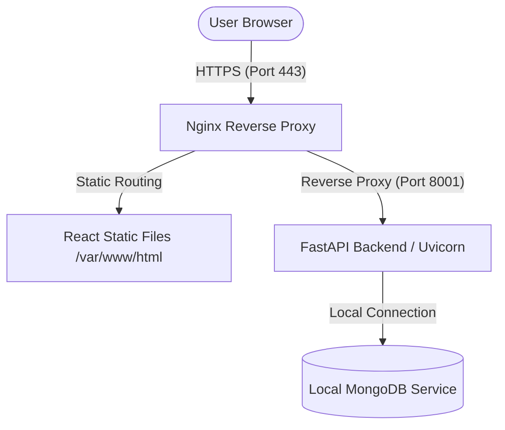

# VidyaOS AWS Deployment Guide (with Local MongoDB Setup)

This guide details two standard paths to deploy the VidyaOS stack (FastAPI Backend + React Frontend + MongoDB Database) on AWS:
1. **Option A (Recommended for Simplicity & Low Cost)**: Single EC2 Ubuntu Instance running MongoDB **locally**, Nginx reverse proxy, and systemd backend services.
2. **Option B (Recommended for Production & High Scale)**: Serverless static hosting (AWS S3 + CloudFront) with a serverless containerized backend (AWS App Runner) and MongoDB Atlas.

---

## 🏗️ Deployment Architecture (Option A - Local DB)



---

## 🚀 Option A: Single EC2 Instance + Local MongoDB & Nginx Setup

### Step 1: Provision your EC2 Instance
1. Open the **AWS Console** and navigate to **EC2** -> **Launch Instance**.
2. **Name**: `vidya-os-server`.
3. **OS**: **Ubuntu Server 24.04 LTS** (HVM), SSD Volume Type.
4. **Instance Type**: `t3.small` (2 vCPUs, 2 GiB RAM recommended to avoid memory limits during Node builds) or `t3.micro`.
5. **Key Pair**: Create a new `.pem` key pair or select an existing one to access the server via SSH.
6. **Network Settings (Security Group)**:
   * [x] **Allow SSH traffic** (Port 22)
   * [x] **Allow HTTPS traffic** (Port 443)
   * [x] **Allow HTTP traffic** (Port 80)
   * *Note: Keep MongoDB port `27017` blocked from public access to ensure database security.*
7. Launch the instance.

---

### Step 2: Access your EC2 Server & Install Dependencies
From your terminal, SSH into your server (using the IP address of your EC2 instance):
```bash
ssh -i "your-key.pem" ubuntu@<ec2-public-ip-address>
```

#### 1. System Package Updates & Node/Python Tools:
Once logged in, update packages and install core build dependencies:
```bash
sudo apt update && sudo apt upgrade -y

# Install Python venv, Pip, Git, and Nginx
sudo apt install python3-pip python3-venv python3-dev build-essential git nginx gnupg curl -y

# Install Node.js (LTS v20)
curl -fsSL https://deb.nodesource.com/setup_20.x | sudo -E bash -
sudo apt install -y nodejs
sudo npm install --global yarn
```

#### 2. Install MongoDB Community Edition Locally:
Run the following commands to import the official GPG key, configure the repository list, and install MongoDB locally on your Ubuntu server:

```bash
# 1. Import MongoDB Public GPG Key
curl -fsSL https://www.mongodb.org/static/pgp/server-7.0.asc | \
  sudo gpg -o /usr/share/keyrings/mongodb-server-7.0.gpg \
  --dearmor --yes

# 2. Add MongoDB APT Repository
echo "deb [ arch=amd64,arm64 signed-by=/usr/share/keyrings/mongodb-server-7.0.gpg ] https://repo.mongodb.org/apt/ubuntu jammy/mongodb-org/7.0 multiverse" | sudo tee /etc/apt/sources.list.d/mongodb-org-7.0.list

# 3. Update Package lists and Install MongoDB
sudo apt update
sudo apt install -y mongodb-org

# 4. Start MongoDB and enable it to run automatically on system boot
sudo systemctl start mongod
sudo systemctl enable mongod
```

Ensure the MongoDB service is active and running cleanly:
```bash
sudo systemctl status mongod
```

---

### Step 3: Clone Code & Configure Environment
Clone your repository into the `/var/www` directory:
```bash
sudo chown -R ubuntu:ubuntu /var/www
cd /var/www
git clone https://github.com/ourtechtheory-droid/vidya-os.git
cd vidya-os
```

#### 1. Setup Backend Environment:
```bash
cd /var/www/vidya-os/backend
python3 -m venv venv
source venv/bin/activate
pip install -r requirements.txt
```

Create a `.env` configuration file in `/var/www/vidya-os/backend/.env`:
```bash
nano .env
```
Add the following content (specifying the **local** MongoDB instance path and database name):
```env
MONGO_URL=mongodb://127.0.0.1:27017
DB_NAME=vidya_db
JWT_SECRET=super-secure-random-string-generate-your-own
PORT=8001
HOST=0.0.0.0
```
*(Press `Ctrl+O` then `Enter` to save, and `Ctrl+X` to exit nano)*

#### 2. Setup Frontend Environment & Build:
```bash
cd /var/www/vidya-os/frontend
```
Create a `.env` configuration file in `/var/www/vidya-os/frontend/.env`:
```bash
nano .env
```
Add the server API path (replace with your domain or server IP):
```env
REACT_APP_API_URL=https://yourdomain.com
```
Now install dependencies and compile the production build:
```bash
yarn install
yarn build
```
This compiles your static assets into the `/var/www/vidya-os/frontend/build` folder.

---

### Step 4: Configure Backend Systemd Daemon
Create a system service file so that your FastAPI python app runs automatically in the background and restarts on system boot.

```bash
sudo nano /etc/systemd/system/vidya-backend.service
```

Paste the following service definition:
```ini
[Unit]
Description=VidyaOS FastAPI Backend Service
After=network.target

[Service]
User=ubuntu
WorkingDirectory=/var/www/vidya-os/backend
ExecStart=/var/www/vidya-os/backend/venv/bin/uvicorn server:app --host 0.0.0.0 --port 8001
Restart=always
EnvironmentFile=/var/www/vidya-os/backend/.env

[Install]
WantedBy=multi-user.target
```

Enable and start the service:
```bash
sudo systemctl daemon-reload
sudo systemctl enable vidya-backend
sudo systemctl start vidya-backend
```

Check the status to ensure it's active:
```bash
sudo systemctl status vidya-backend
```

---

### Step 5: Configure Nginx Reverse Proxy & Static Hosting
Nginx will handle routing traffic: standard static files will serve the React build, and `/api` requests will reverse-proxy directly to port `8001`.

Create an Nginx configuration file:
```bash
sudo nano /etc/nginx/sites-available/vidya-os
```

Paste the following configuration:
```nginx
server {
    listen 80;
    server_name yourdomain.com www.yourdomain.com; # Replace with your real domain or EC2 Public IP

    # React frontend static files
    location / {
        root /var/www/vidya-os/frontend/build;
        try_files $uri $uri/ /index.html;
    }

    # FastAPI backend proxy routing
    location /api {
        proxy_pass http://127.0.0.1:8001;
        proxy_http_version 1.1;
        proxy_set_header Upgrade $http_upgrade;
        proxy_set_header Connection 'upgrade';
        proxy_set_header Host $host;
        proxy_cache_bypass $http_upgrade;
        proxy_set_header X-Real-IP $remote_addr;
        proxy_set_header X-Forwarded-For $proxy_add_x_forwarded_for;
        proxy_set_header X-Forwarded-Proto $scheme;
    }
}
```

Enable the configuration and reload Nginx:
```bash
sudo ln -s /etc/nginx/sites-available/vidya-os /etc/nginx/sites-enabled/
sudo rm /etc/nginx/sites-enabled/default # Remove default Nginx welcome page
sudo nginx -t # Validate syntax
sudo systemctl restart nginx
```

---

### Step 6: Secure with Free SSL (Let's Encrypt / Certbot)
To run over secure HTTPS, automate your SSL certificates with Let's Encrypt:

```bash
sudo apt install certbot python3-certbot-nginx -y
sudo certbot --nginx -d yourdomain.com -d www.yourdomain.com
```
Follow the interactive prompts to secure your domain. Nginx will automatically reload with fully valid SSL configurations and redirect HTTP requests to HTTPS!
